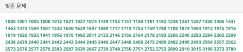
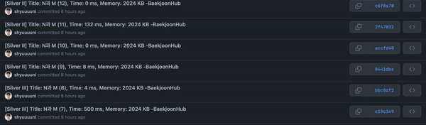

# [BOJ Accepted Uploader](src폴더) [](https://github.com/facebook/react/blob/main/LICENSE) 




**NOTE**
> [백준허브(BaekjoonHub)](https://chrome.google.com/webstore/detail/백준허브baekjoonhub/ccammcjdkpgjmcpijpahlehmapgmphmk?hl=ko) 크롬 확장 프로그램 버전 1.0.12 버전 기준으로 작성된 프로그램입니다. 이후 버전의 확장 프로그램에 해당 기능이 추가될 수 있습니다.

## BOJ Accepted Uploader

BOJ Accepted Uploader는 기존 백준 AC(Accepted) 문제들에 크롬 확장 프로그램인 백준허브를 적용할 수 있도록 도와주는 프로그램입니다.

백준허브는 [1.0.9 버전 패치노트](https://github.com/BaekjoonHub/BaekjoonHub/blob/v.1.1.1/Patch_Notes/1.0.9.md)를 통해 전체 업로드 기능을 제거했기 때문에 작성일인 1.0.12버전에서 기존 백준 문제들에 대한 커밋을 진행할 수 없는 상황입니다.

따라서 본 프로그램을 통해 기존에 제출했던 BOJ 사이트의 맞은 문제들(AC, Accepted)에 대해서 사용자가 편리하게 백준허브를 적용할 수 있도록 지원합니다.


## Installation

BOJ Accepted Uploader는 ```Python3.8.2``` 버전에서 작성되었기 때문에 ```Python3``` 이상의 버전이 필요합니다.

또한 프로그램 실행시 추가로 실행되는 많은 크롬 브라우저 종료를 위해 ```psutil``` 라이브러리를 사용합니다. 따라서 다음 명령어를 통해 ```psutil``` 라이브러리를 설치합니다.

```shell
$ pip install psutil  # pip user
$ pip3 install psutil # pip3 user
```

## Usage

BOJ Accepted Uploader는 다음과 같은 두개의 파일로 구성되어 있습니다.

* ```accepted.txt``` 파일은 ```https://www.acmicpc.net/user/{username}``` 링크의 맞은 문제 번호들을 복사해서 띄어쓰기 단위로 구분하여 저장한 파일입니다.

* ```boj_accepted_uploader.py``` 파일은 다음과 같이 실행시켜서 BOJ 사이트의 맞은 문제들에 대한 백준허브 적용을 진행합니다.

    ```shell
    cd src/
    python3 boj_accepted_uploader.py --boj_id=seunghyun4525 --ac=accepted.txt --begin=0
    ```
    * ```--boj_id``` 는 필수로 입력해야 하는 값으로, 본인의 백준 아이디를 입력합니다.
    * ```--ac``` 는 ```accepted.txt``` 파일의 경로로, 기본값으로 ```accepted.txt```을 제공합니다.
    * ```--begin``` 은 최소 문제 번호로, 해당 번호 이상의 번호들에 대해서만 백준허브 적용을 진행합니다. 기본값으로 0을 제공합니다.
  

## Document

* [변경사항](docs/CHANGES.md)
* [개발일지](docs/DEVNOTE.md)


## License [](https://github.com/facebook/react/blob/main/LICENSE)

```
MIT License

Copyright (c) 2022 seunghyun4525

Permission is hereby granted, free of charge, to any person obtaining a copy
of this software and associated documentation files (the "Software"), to deal
in the Software without restriction, including without limitation the rights
to use, copy, modify, merge, publish, distribute, sublicense, and/or sell
copies of the Software, and to permit persons to whom the Software is
furnished to do so, subject to the following conditions:

The above copyright notice and this permission notice shall be included in all
copies or substantial portions of the Software.

THE SOFTWARE IS PROVIDED "AS IS", WITHOUT WARRANTY OF ANY KIND, EXPRESS OR
IMPLIED, INCLUDING BUT NOT LIMITED TO THE WARRANTIES OF MERCHANTABILITY,
FITNESS FOR A PARTICULAR PURPOSE AND NONINFRINGEMENT. IN NO EVENT SHALL THE
AUTHORS OR COPYRIGHT HOLDERS BE LIABLE FOR ANY CLAIM, DAMAGES OR OTHER
LIABILITY, WHETHER IN AN ACTION OF CONTRACT, TORT OR OTHERWISE, ARISING FROM,
OUT OF OR IN CONNECTION WITH THE SOFTWARE OR THE USE OR OTHER DEALINGS IN THE
SOFTWARE.
```
